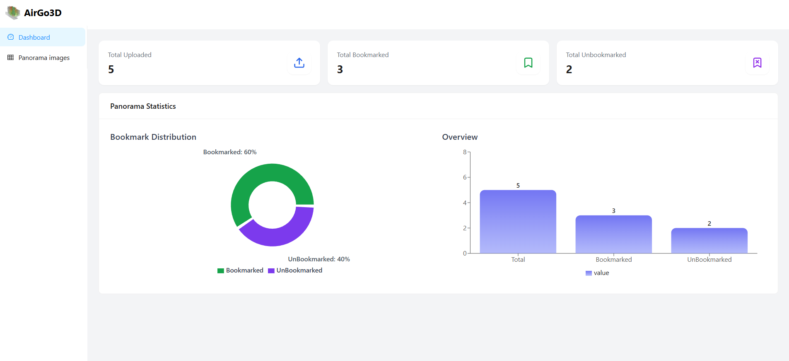
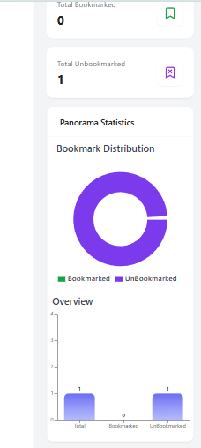
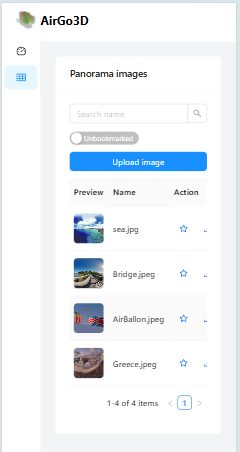
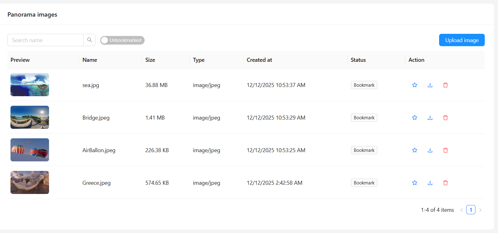
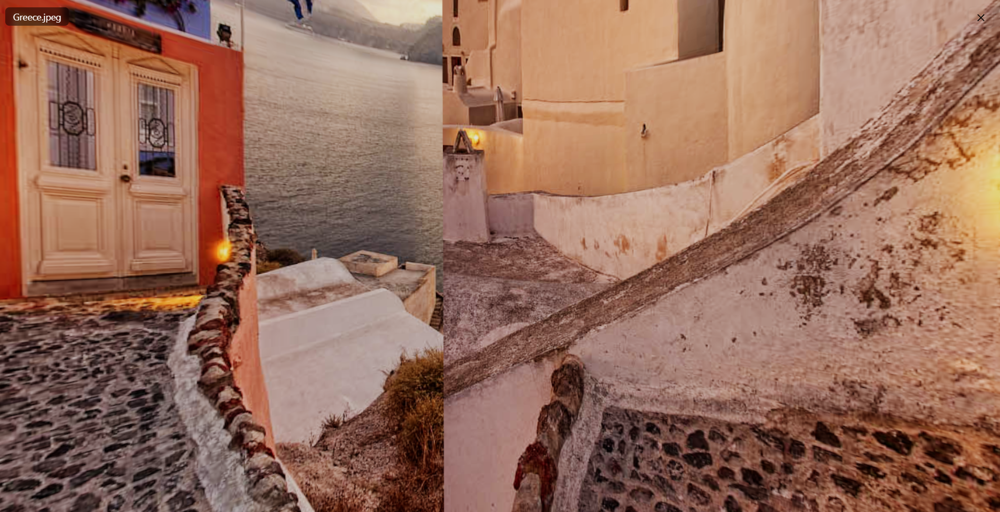

# AirGo3D – Airsquire fullstack engineer interview project

---

- [Demo Video](video/demo.mp4)
  
   
  
  

## ✨ Features

### 🔹 Core Features

- Upload & download panorama images
- View images in full 360° panorama mode (Three.js)
- Metadata listing in table view
- Search panoramas by name
- Bookmark / unbookmark panoramas
- Filter bookmarks
- Analytics dashboard (bookmarked vs non-bookmarked)
- Activity logging (backend)

### 🔹 Advanced Features

- GraphQL API (Apollo Server)
- Redux Toolkit for state management
- Apollo Client for data fetching
- Responsive UI with Ant Design
- TypeScript across entire project
- Docker & Docker Compose support
- Winston logging system
- Jest test (backend)
- playwright E2E (frontend)

---

## 🏗 Tech Stack

### Backend

- Node.js + Express
- GraphQL (Apollo Server)
- MongoDB + Mongoose
- TypeScript
- Multer for file uploads
- Winston for logging
- Docker / Docker Compose

### Frontend

- React + TypeScript
- Redux Toolkit
- Apollo Client
- Ant Design
- React Three Fiber + Three.js
- Recharts
- React Router
- Webpack

---

## 🚀 Getting Started

### Prerequisites

- Node.js ≥ 14 (Recommended Node.js 18)
- Yarn
- MongoDB (if not using Docker)
- Docker + Docker Compose (optional)

---

## 📦 Installation

### 1️⃣ Clone repository

```bash
git clone https://github.com/ThaiHocvn/AirGo3D.git
cd AirGo3D

2️⃣ Backend setup
cd backend
yarn install
cp .env.example .env
# Update .env with DB connection, ports, etc.

3️⃣ Frontend setup
cd ../frontend
yarn install
cp .env.example .env
# Configure GRAPHQL_URL

▶ Running the Project
Option A — Using Docker (Recommended)
cd backend
yarn up

Starts:
MongoDB @ 27017
Backend API @ 4000

Frontend:
cd frontend
yarn up

Frontend dev server:
➡ http://localhost:3000

Option B — Run Manually
Backend
cd backend
yarn dev

API: http://localhost:4000/graphql

Frontend
cd frontend
yarn start


UI: http://localhost:3000

🧪 Testing
Backend tests
cd backend
yarn test
yarn test:watch
yarn test:coverage

Frontend tests (Playwright)
cd frontend
yarn test
yarn test:ui
yarn test:debug
yarn test:report

📊 API Documentation
GraphQL Endpoint

http://localhost:4000/graphql

Main Queries
panoramas(search, isBookmarked, limit, offset)
panoramaStats

Main Mutations
uploadPanorama(file, name)
deletePanorama(id)
toggleBookmark(id)

REST Endpoints
GET api/image-preview/:id
GET api/image-thumbnail/:id

🐳 Docker Deployment
From backend folder:
docker-compose up -d


Creates:
MongoDB container
Backend container
Volumes for uploads & logs

📝 Notes
Use equirectangular (2:1) images for best 360° results
Supported formats: JPEG, PNG, WebP
Max file size: 100MB
Logs stored in MongoDB + Winston logs folder
```
